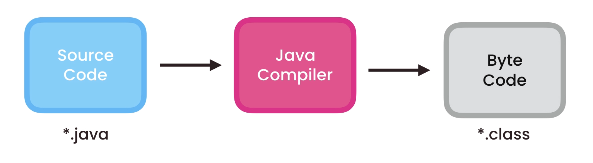

# java-basics
----

## I. Fundamentals

### How Java Code Gets Executed

Java source code is compiled into bytecode when we use the `javac` compiler. The bytecode gets saved on the disk with the file extension .class. When the program is to be run, the bytecode is converted, using the just-in-time (JIT) compiler. The result is machine code which is then fed to the memory and is executed.

### Primitives vs. References

Primitive | Reference
--- | ---
Primitive types are the basic types of data. | Reference types are any instantiable class as well as arrays.
`byte, short, int, long, float, double, boolean, char` | `String, Scanner, Random, Die, int[], String[], etc.`
Primitive variables store primitive values. | Reference variables store addresses.

## Java Type Casting

Type casting is when you assign a value of one primitive data type to another type.

In Java, there are two types of casting:
* **Widening Casting (automatically)** - converting a smaller type to a larger size type.
`byte` -> `short` -> `char` -> `int` -> `long` -> `float` -> `double`
* **Narrowing Casting (manually)** - converting a larger type to a smaller size type.
`double` -> `float` -> `long` -> `int` -> `char` -> `short` -> `byte`

----
## II. Object Oriented Programming

### Encapsulation

Encapsulation in Java is a mechanism of wrapping the data (variables) and code acting on the data (methods) together as a single unit. In encapsulation, the variables of a class will be hidden from other classes, and can be accessed only through the methods of their current class. Therefore, it is also known as data hiding.

### Abstraction

Data Abstraction may be defined as the process of identifying only the required characteristics of an object ignoring the irrelevant details.

### Coupling

In object oriented design, Coupling refers to the degree of direct knowledge that one element has of another. In other words, how often do changes in class A force related changes in class B.
Low coupling often correlates with high cohesion, and vice versa. Low coupling is often a sign of a well-structured computer system and a good design, and when combined with high cohesion, supports the general goals of high readability and maintainability.
